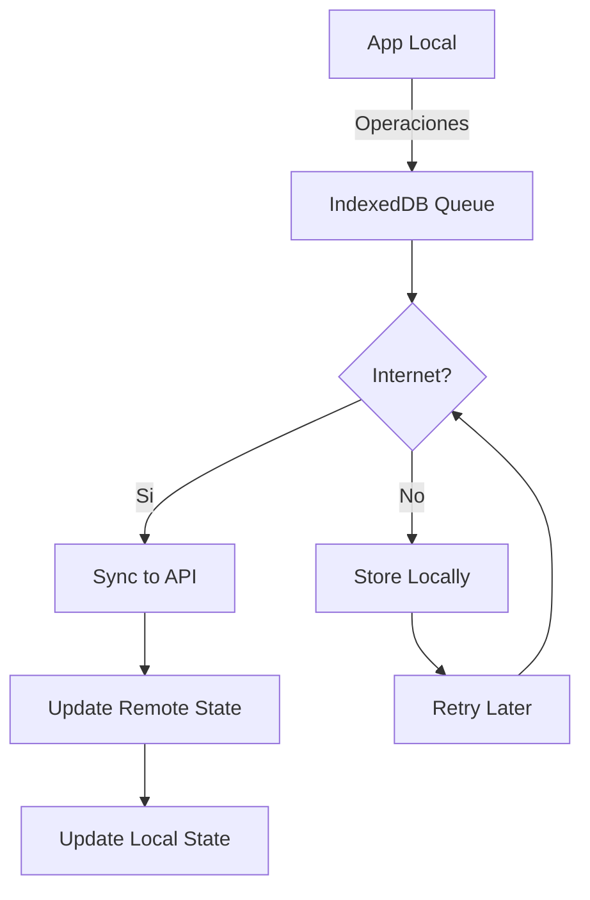
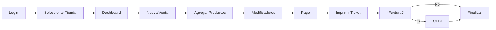

# CoffeeOS - Documentación Técnica

## 📚 Índice General

### 🏗️ Arquitectura

- [Visión General de la Arquitectura](./architecture/overview.md)
- [Stack Tecnológico](./architecture/tech-stack.md)
- [Patrones de Diseño](./architecture/design-patterns.md)
- [Multi-tenancy](./architecture/multi-tenancy.md)

### 🚀 Guía de Inicio

- [Configuración del Entorno](./getting-started/setup.md)
- [Primeros Pasos](./getting-started/first-steps.md)
- [Estructura del Proyecto](./getting-started/project-structure.md)

### 🔌 APIs y Servicios

- [API Reference](./api/README.md)
- [GraphQL Schema](./api/graphql.md)
- [Webhooks](./api/webhooks.md)
- [Rate Limiting](./api/rate-limiting.md)

### 📱 Aplicaciones

- [POS Web App](./apps/pos-web.md)
- [Admin Dashboard](./apps/admin-web.md)
- [Mobile App](./apps/mobile.md)
- [PWA Features](./apps/pwa.md)

### 🗄️ Base de Datos

- [Schema Prisma](./database/schema.md)
- [Migraciones](./database/migrations.md)
- [Seeders](./database/seeders.md)
- [Backup y Restauración](./database/backup.md)

### 🔌 Integraciones

- [Baserow](./integrations/baserow.md)
- [n8n Workflows](./integrations/n8n.md)
- [Twilio WhatsApp/SMS](./integrations/twilio.md)
- [Mailrelay](./integrations/mailrelay.md)
- [CFDI/PAC](./integrations/cfdi.md)
- [Pagos México](./integrations/payments-mx.md)

### 🏪 Módulos de Negocio

- [POS & Operaciones](./modules/pos.md)
- [Inventario](./modules/inventory.md)
- [Recetas y Costeo](./modules/recipes.md)
- [Calidad y Checklists](./modules/quality.md)
- [CRM y Lealtad](./modules/crm.md)
- [Finanzas](./modules/finance.md)
- [RRHH](./modules/hr.md)
- [Analytics](./modules/analytics.md)

### 🛡️ Seguridad

- [Autenticación](./security/authentication.md)
- [Autorización RBAC](./security/authorization.md)
- [Encriptación](./security/encryption.md)
- [Auditoría](./security/audit.md)

### ⚡ Rendimiento

- [Optimización](./performance/optimization.md)
- [Caching](./performance/caching.md)
- [Offline-first](./performance/offline.md)
- [Monitoreo](./performance/monitoring.md)

### 🐳 DevOps

- [Docker](./devops/docker.md)
- [CI/CD](./devops/ci-cd.md)
- [Terraform](./devops/terraform.md)
- [Monitoring](./devops/monitoring.md)

### 🧪 Testing

- [Estrategia de Testing](./testing/strategy.md)
- [Unit Tests](./testing/unit.md)
- [Integration Tests](./testing/integration.md)
- [E2E Tests](./testing/e2e.md)
- [Load Testing](./testing/load.md)

### 📋 Cumplimiento

- [NOM-251](./compliance/nom-251.md)
- [LFPDPPP](./compliance/lfpdppp.md)
- [CFDI 4.0](./compliance/cfdi.md)
- [Protección Civil](./compliance/safety.md)

### 🌍 Localización

- [Mercado Mexicano](./localization/mexico.md)
- [Internacionalización](./localization/i18n.md)
- [Monedas y Pagos](./localization/payments.md)

### 📊 Analytics y BI

- [KPIs del Negocio](./analytics/kpis.md)
- [Dashboards](./analytics/dashboards.md)
- [Reportes Automáticos](./analytics/reports.md)
- [Data Pipeline](./analytics/pipeline.md)

## 🚦 Flujos de Trabajo

### 📋 Plan Maestro → Software

1. **Operación Diaria**
   - Apertura de tienda (checklist)
   - Procesamiento de ventas (POS)
   - Control de inventario (par levels)
   - Cierre de tienda (arqueo)

2. **Gestión Semanal**
   - Recepción de mercancía
   - Evaluación de personal
   - Análisis de ventas
   - Campañas de marketing

3. **Administración Mensual**
   - Reportes financieros P&L
   - Renovación de permisos
   - Análisis de proveedores
   - Planificación estratégica

### 🔄 Sincronización Offline

### 📱 Flujo de Usuario POS

## 🎯 Objetivos de Performance

### ⚡ Frontend (POS Web)

- **First Contentful Paint**: < 1.5s
- **Largest Contentful Paint**: < 2.5s
- **Time to Interactive**: < 3s
- **Cumulative Layout Shift**: < 0.1

### 🔧 Backend (API)

- **Response Time P95**: < 200ms
- **Throughput**: > 1000 req/s
- **Error Rate**: < 0.1%
- **Uptime**: > 99.9%

### 📱 Mobile App

- **App Start Time**: < 2s
- **Screen Transition**: < 100ms
- **Offline Sync**: < 5s
- **Battery Efficient**: < 2% per hour

## 🚨 SLAs y Métricas

### 📊 Disponibilidad

- **Producción**: 99.95% uptime
- **Staging**: 99% uptime
- **Desarrollo**: Best effort

### 🔄 Backup y Recovery

- **RTO** (Recovery Time Objective): < 4 horas
- **RPO** (Recovery Point Objective): < 1 hora
- **Backup Frequency**: Cada 6 horas
- **Backup Retention**: 30 días

### 📈 Escalabilidad

- **Usuarios Concurrentes**: 10,000+
- **Transacciones/segundo**: 500+
- **Tiendas por Tenant**: 100+
- **Crecimiento Anual**: 200%

## 📞 Soporte y Contacto

### 🆘 Emergencias de Producción

- **Slack**: #coffeeos-alerts
- **PagerDuty**: https://coffeeos.pagerduty.com
- **Hotline**: +52 55 1234 5678 (24/7)

### 💬 Comunicación del Equipo

- **Daily Standups**: 9:00 AM CST
- **Sprint Planning**: Lunes 10:00 AM
- **Retrospectivas**: Viernes 4:00 PM
- **Demo**: Cada 2 semanas

### 📚 Recursos Adicionales

- **Confluence**: Documentación interna
- **Jira**: Gestión de proyectos
- **GitHub**: Código fuente
- **Docker Hub**: Imágenes de contenedores

---

**📅 Última actualización**: 15 de Octubre, 2025
**🔄 Próxima revisión**: 1 de Noviembre, 2025
