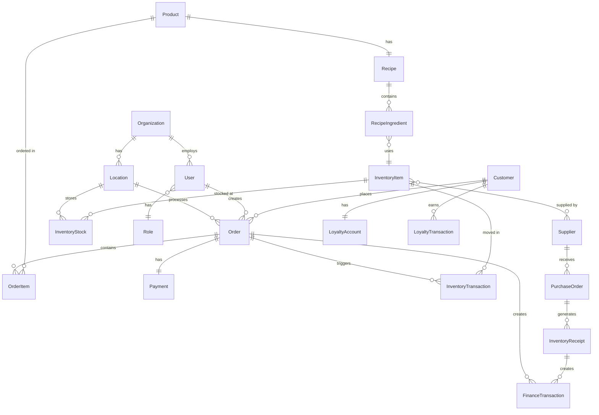

# 🏗️ Arquitectura del Sistema CoffeeOS

## 📊 Sistema Relacional Integrado

CoffeeOS es un **sistema completamente integrado** donde cada operación afecta múltiples módulos en cascada. No hay componentes aislados - todo está conectado para reflejar la realidad operativa de una cafetería.

---

## 🔄 Flujo de una Venta en el POS

### Ejemplo: Venta de 1 Americano ($40)

```
┌─────────────────────────────────────────────────────────────┐
│                    VENTA EN POS                             │
│              1x Americano - $40                             │
└─────────────────────────────────────────────────────────────┘
                          ↓
        ┌─────────────────┴─────────────────┐
        ↓                                   ↓
┌───────────────┐                   ┌──────────────┐
│  AUTH         │                   │  INVENTORY   │
│  ✓ Usuario    │                   │  - 18g Café  │
│  ✓ Permisos   │                   │  - 180ml H₂O │
│  ✓ Sucursal   │                   └──────┬───────┘
└───────────────┘                          ↓
        ↓                           ┌──────────────┐
┌───────────────┐                   │  RECIPES     │
│  ORDERS       │                   │  Costeo:     │
│  + Orden #123 │                   │  $2.88 costo │
│  Status: Paid │                   └──────┬───────┘
└───────┬───────┘                          ↓
        ↓                           ┌──────────────┐
┌───────────────┐                   │  FINANCE     │
│  PAYMENTS     │                   │  + Revenue   │
│  + $40 Efectivo│◄─────────────────┤  + P&L       │
│  IVA: $6.40   │                   │  + Margen    │
└───────┬───────┘                   └──────┬───────┘
        ↓                                  ↓
┌───────────────┐                   ┌──────────────┐
│  ANALYTICS    │                   │  SUPPLIERS   │
│  + Daily Sales│                   │  Alerta:     │
│  + Ticket Avg │                   │  Reorden Café│
└───────┬───────┘                   └──────────────┘
        ↓
┌───────────────┐
│  CRM          │
│  + Puntos     │
│  + RFM Score  │
└───────────────┘
```

---

## 🔗 Matriz de Relaciones

### Impacto de una Venta

| Acción                 | Módulo Afectado | Efecto                             |
| ---------------------- | --------------- | ---------------------------------- |
| **Venta Iniciada**     | `auth`          | Valida usuario, permisos, sucursal |
|                        | `products`      | Obtiene info del producto, precio  |
|                        | `recipes`       | Carga receta, ingredientes, costeo |
| **Agregar al Carrito** | `pos`           | Calcula subtotal, impuestos        |
|                        | `inventory`     | Verifica disponibilidad            |
|                        | `modifiers`     | Aplica personalizaciones           |
| **Confirmar Orden**    | `orders`        | Crea registro de orden             |
|                        | `inventory`     | **Deduce stock automáticamente**   |
|                        | `recipes`       | Registra uso de ingredientes       |
| **Procesar Pago**      | `payments`      | Registra transacción               |
|                        | `finance`       | Actualiza ingresos del día         |
|                        | `analytics`     | Incrementa métricas                |
| **Orden Completada**   | `crm`           | Suma puntos de lealtad             |
|                        | `analytics`     | Actualiza KPIs en tiempo real      |
|                        | `finance`       | Calcula P&L instantáneo            |
|                        | `suppliers`     | Evalúa punto de reorden            |
|                        | `quality`       | Registra uso para trazabilidad     |

---

## 📐 Arquitectura por Capas

```
┌─────────────────────────────────────────────────────────────┐
│                     PRESENTATION LAYER                      │
│  Frontend (Next.js) - POS, Dashboard, Reports               │
└────────────────────────┬────────────────────────────────────┘
                         ↓
┌─────────────────────────────────────────────────────────────┐
│                      API LAYER (NestJS)                     │
│  REST API + WebSockets + GraphQL (opcional)                 │
└────────────────────────┬────────────────────────────────────┘
                         ↓
┌─────────────────────────────────────────────────────────────┐
│                    BUSINESS LOGIC LAYER                     │
│  ┌──────────┬──────────┬──────────┬──────────┬──────────┐  │
│  │   Auth   │   POS    │ Inventory│  Finance │   CRM    │  │
│  └──────────┴──────────┴──────────┴──────────┴──────────┘  │
│  ┌──────────┬──────────┬──────────┬──────────┬──────────┐  │
│  │ Products │ Recipes  │ Suppliers│ Quality  │ Analytics│  │
│  └──────────┴──────────┴──────────┴──────────┴──────────┘  │
└────────────────────────┬────────────────────────────────────┘
                         ↓
┌─────────────────────────────────────────────────────────────┐
│                      DATA ACCESS LAYER                      │
│  Prisma ORM + Query Builders + Transactions                 │
└────────────────────────┬────────────────────────────────────┘
                         ↓
┌─────────────────────────────────────────────────────────────┐
│                       DATA LAYER                            │
│  PostgreSQL (Primary) + Redis (Cache) + S3 (Files)         │
└─────────────────────────────────────────────────────────────┘
```

---

## 🔄 Flujos de Integración Detallados

### 1. Flujo de Venta Completo

```typescript
// Pseudocódigo del flujo
async function processSale(items, payment) {
  // 1. Autenticación y Autorización
  const user = await auth.getCurrentUser();
  await auth.checkPermissions(user, 'pos.sell');
  const location = await auth.getUserLocation(user);

  // 2. Validar Disponibilidad
  for (const item of items) {
    const recipe = await recipes.getByProductId(item.productId);
    const available = await inventory.checkAvailability(
      recipe.ingredients,
      location.id,
    );
    if (!available) throw new Error('Producto no disponible');
  }

  // 3. Crear Orden
  const order = await orders.create({
    locationId: location.id,
    userId: user.id,
    items: items,
    subtotal: calculateSubtotal(items),
    tax: calculateTax(items),
    total: calculateTotal(items),
    status: 'pending',
  });

  // 4. Deducir Inventario (Transacción Atómica)
  await db.transaction(async (tx) => {
    for (const item of items) {
      const recipe = await tx.recipes.getByProductId(item.productId);

      for (const ingredient of recipe.ingredients) {
        await tx.inventory.deduct({
          itemId: ingredient.inventoryItemId,
          quantity: ingredient.quantity * item.quantity,
          locationId: location.id,
          orderId: order.id,
          reason: 'sale',
        });

        // Verificar punto de reorden
        const stock = await tx.inventory.getCurrentStock(
          ingredient.inventoryItemId,
          location.id,
        );

        if (stock <= ingredient.reorderPoint) {
          await tx.suppliers.createPurchaseOrder({
            itemId: ingredient.inventoryItemId,
            quantity: ingredient.parLevel - stock,
            urgent: stock <= ingredient.criticalLevel,
          });
        }
      }
    }
  });

  // 5. Procesar Pago
  const paymentRecord = await payments.process({
    orderId: order.id,
    amount: order.total,
    method: payment.method,
    reference: payment.reference,
  });

  // 6. Actualizar Finanzas
  await finance.recordRevenue({
    orderId: order.id,
    amount: order.total,
    tax: order.tax,
    date: new Date(),
    locationId: location.id,
    categoryId: 'sales',
  });

  // 7. Actualizar CRM
  if (payment.customerId) {
    await crm.addLoyaltyPoints({
      customerId: payment.customerId,
      points: Math.floor(order.total / 10),
      orderId: order.id,
    });

    await crm.updateRFM({
      customerId: payment.customerId,
      orderDate: new Date(),
      orderValue: order.total,
    });
  }

  // 8. Actualizar Analytics
  await analytics.recordSale({
    orderId: order.id,
    locationId: location.id,
    items: items,
    total: order.total,
    timestamp: new Date(),
  });

  // 9. Actualizar Orden
  await orders.update(order.id, {
    status: 'completed',
    completedAt: new Date(),
  });

  // 10. Emitir Eventos
  await events.emit('sale.completed', {
    orderId: order.id,
    locationId: location.id,
    total: order.total,
  });

  return order;
}
```

---

### 2. Flujo de Recepción de Inventario

```typescript
async function receiveInventory(purchaseOrder) {
  // 1. Validar Orden de Compra
  const po = await suppliers.getPurchaseOrder(purchaseOrder.id);
  if (po.status !== 'approved') throw new Error('PO no aprobada');

  // 2. Registrar Recepción
  const receipt = await inventory.createReceipt({
    poId: po.id,
    supplierId: po.supplierId,
    items: purchaseOrder.items,
    receivedBy: auth.getCurrentUser().id,
    locationId: auth.getUserLocation().id,
  });

  // 3. Actualizar Stock (Transacción)
  await db.transaction(async (tx) => {
    for (const item of purchaseOrder.items) {
      await tx.inventory.increment({
        itemId: item.inventoryItemId,
        quantity: item.quantityReceived,
        locationId: receipt.locationId,
        cost: item.unitCost,
        receiptId: receipt.id,
      });
    }
  });

  // 4. Actualizar Finanzas
  await finance.recordExpense({
    receiptId: receipt.id,
    amount: receipt.total,
    categoryId: 'inventory',
    supplierId: po.supplierId,
    date: new Date(),
  });

  // 5. Evaluar Proveedor
  await suppliers.recordPerformance({
    supplierId: po.supplierId,
    orderId: po.id,
    onTime: receipt.receivedAt <= po.expectedDate,
    qualityScore: receipt.qualityScore,
  });

  // 6. Actualizar Orden de Compra
  await suppliers.updatePO(po.id, {
    status: 'received',
    receivedAt: new Date(),
  });

  return receipt;
}
```

---

### 3. Flujo de Merma de Inventario

```typescript
async function recordWaste(items, reason) {
  // 1. Crear Registro de Merma
  const waste = await inventory.createWaste({
    items: items,
    reason: reason,
    reportedBy: auth.getCurrentUser().id,
    locationId: auth.getUserLocation().id,
    date: new Date(),
  });

  // 2. Deducir Inventario
  await db.transaction(async (tx) => {
    for (const item of items) {
      await tx.inventory.deduct({
        itemId: item.inventoryItemId,
        quantity: item.quantity,
        locationId: waste.locationId,
        wasteId: waste.id,
        reason: 'waste',
      });
    }
  });

  // 3. Impactar Finanzas (Pérdida)
  const totalCost = items.reduce(
    (sum, item) => sum + item.quantity * item.costPerUnit,
    0,
  );

  await finance.recordLoss({
    wasteId: waste.id,
    amount: totalCost,
    categoryId: 'waste',
    date: new Date(),
  });

  // 4. Actualizar Analytics
  await analytics.recordWaste({
    wasteId: waste.id,
    items: items,
    totalCost: totalCost,
    reason: reason,
  });

  // 5. Alerta de Calidad (si aplica)
  if (reason === 'quality_issue') {
    await quality.createAlert({
      type: 'waste_quality',
      severity: 'high',
      wasteId: waste.id,
      items: items,
    });
  }

  return waste;
}
```

---

## 🗄️ Modelo de Datos Relacional

### Entidades Principales y sus Relaciones



---

## 🎯 Principios de Diseño

### 1. **Transaccionalidad**

Todas las operaciones críticas usan transacciones de base de datos para garantizar consistencia:

```typescript
await prisma.$transaction(async (tx) => {
  // Todas las operaciones aquí son atómicas
  await tx.inventory.deduct(...);
  await tx.finance.record(...);
  await tx.analytics.update(...);
  // Si algo falla, TODO se revierte
});
```

### 2. **Event-Driven Architecture**

Los módulos se comunican mediante eventos para desacoplar lógica:

```typescript
// Emisor
await events.emit('order.completed', orderData);

// Receptor 1: CRM
events.on('order.completed', async (data) => {
  await crm.addLoyaltyPoints(data);
});

// Receptor 2: Analytics
events.on('order.completed', async (data) => {
  await analytics.recordSale(data);
});
```

### 3. **Domain-Driven Design**

Cada módulo es un bounded context con su propia lógica de negocio:

```
/modules
  /pos          → Dominio: Punto de Venta
  /inventory    → Dominio: Gestión de Stock
  /finance      → Dominio: Contabilidad
  /crm          → Dominio: Clientes
```

### 4. **CQRS Pattern (Command Query Responsibility Segregation)**

Separación entre operaciones de escritura y lectura:

```typescript
// Commands (Escritura)
class CreateOrderCommand {
  async execute(data) {
    // Validar, crear, emitir eventos
  }
}

// Queries (Lectura)
class GetOrdersQuery {
  async execute(filters) {
    // Solo lectura, sin side effects
  }
}
```

---

## 📊 Casos de Uso Completos

### Caso 1: Venta con Cliente Registrado

```
1. Cliente llega → CRM obtiene historial
2. Barista agrega items → POS calcula precio
3. Sistema verifica stock → Inventory check
4. Cliente paga → Payments procesa
5. Sistema deduce inventario → Inventory.deduct()
6. Sistema registra venta → Finance.recordRevenue()
7. Sistema suma puntos → CRM.addPoints()
8. Sistema actualiza métricas → Analytics.update()
9. Sistema evalúa reorden → Suppliers.checkReorder()
10. Cliente recibe recibo → Receipt generated
```

### Caso 2: Orden de Compra a Proveedor

```
1. Sistema detecta bajo stock → Inventory alert
2. Manager revisa → Suppliers.getPending()
3. Manager crea PO → Suppliers.createPO()
4. Proveedor confirma → Email/SMS notification
5. Inventario llega → Inventory.receive()
6. Sistema actualiza stock → Inventory.increment()
7. Sistema registra gasto → Finance.recordExpense()
8. Sistema evalúa proveedor → Suppliers.rate()
9. Sistema actualiza P&L → Finance.updatePL()
```

### Caso 3: Cierre de Caja Diario

```
1. Manager inicia cierre → Auth.checkPermission()
2. Sistema cuenta ventas → Orders.getDailySales()
3. Sistema cuenta pagos → Payments.getDailyTotal()
4. Sistema calcula gastos → Finance.getDailyExpenses()
5. Sistema genera P&L → Finance.generatePL()
6. Sistema compara efectivo → POS.cashCount()
7. Sistema detecta diferencia → Finance.recordVariance()
8. Sistema genera reporte → Reports.generateDailySummary()
9. Sistema notifica → Notifications.send()
10. Sistema cierra día → Operations.closeDailyPeriod()
```

---

## 🧪 Testing Strategy

### Unit Tests

- Cada módulo aislado
- Mocks de dependencias
- Cobertura > 80%

### Integration Tests

- Flujos entre 2-3 módulos
- Base de datos real (test container)
- Transacciones reales

### E2E Tests

- Flujos completos de usuario
- Desde UI hasta DB
- Verificación de side effects

### Performance Tests

- Carga simultánea (100+ orders/min)
- Stress test de inventario
- Latencia de APIs < 200ms

---

## 🚀 Escalabilidad

### Estrategias

1. **Database Sharding**
   - Por organización
   - Por ubicación geográfica

2. **Redis Caching**
   - Productos frecuentes
   - Recetas
   - Stock actual

3. **Queue System**
   - Deferred tasks (emails, reports)
   - Async inventory updates
   - Analytics aggregation

4. **Microservices Ready**
   - Cada módulo puede ser servicio independiente
   - API Gateway
   - Service mesh

---

## 📈 Monitoreo

### Métricas Clave

```typescript
// Real-time metrics
-orders_per_minute -
  inventory_transactions_per_second -
  api_response_time -
  database_query_time -
  cache_hit_ratio -
  // Business metrics
  daily_revenue -
  average_ticket -
  inventory_turnover -
  customer_retention -
  margin_percentage;
```

---

## ✅ Checklist de Integración

Para cada nuevo feature:

- [ ] Identifica módulos afectados
- [ ] Diseña transacción atómica
- [ ] Define eventos emitidos
- [ ] Documenta side effects
- [ ] Escribe unit tests
- [ ] Escribe integration tests
- [ ] Verifica rollback scenarios
- [ ] Prueba performance
- [ ] Documenta en architecture
- [ ] Actualiza diagramas

---

**Última actualización:** 27 de Octubre, 2025  
**Versión:** 1.0.0  
**Mantenido por:** Development Team
