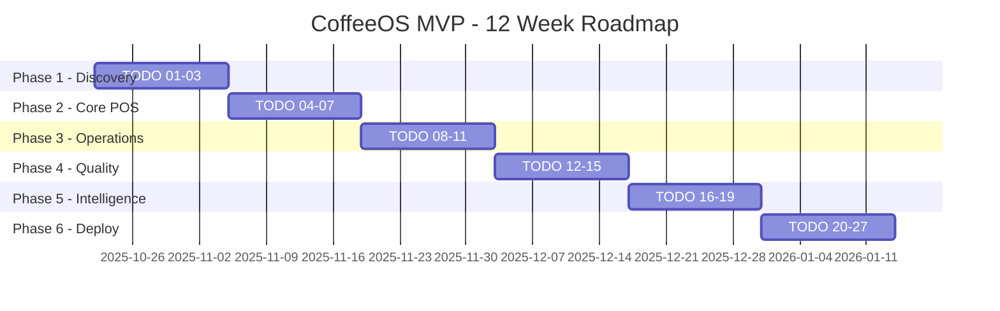

# 📋 CoffeeOS TODOs Master Index

**Proyecto**: CoffeeOS MVP - Plataforma Multi-tenant para Cafeterías  
**Objetivo**: 27 TODOs para entregar MVP operativo en 12 semanas  
**Metodología**: Desarrollo ágil con entregas incrementales por semana

---

## 🎯 Quick Navigation

| Fase             | Semanas | TODOs | Status          | Objetivo                      |
| ---------------- | ------- | ----- | --------------- | ----------------------------- |
| 🔍 **Discovery** | 1-2     | 01-03 | 📝 Planificados | UX Research + Design System   |
| ⚡ **Core POS**  | 3-4     | 04-07 | ⏳ Por crear    | Auth + Productos + POS Engine |
| 🍯 **Recipes**   | 5-6     | 08-11 | ⏳ Por crear    | Recetas + Costeo + Inventario |
| 📋 **Quality**   | 7-8     | 12-15 | ⏳ Por crear    | Checklists + CRM + Loyalty    |
| 📊 **Analytics** | 9-10    | 16-19 | ⏳ Por crear    | KPIs + Finanzas + CFDI        |
| 🔧 **Deploy**    | 11-12   | 20-27 | ⏳ Por crear    | Integraciones + Go-Live       |

---

## 📁 TODOs Detallados por Fase

### 🔥 FASE 1: Discovery & UX Foundation (Semanas 1-2)

#### ✅ [TODO 01: Research & User Journey Mapping](./todos/TODO-01-Research-User-Journey.md)

- **Owner**: Product Manager + UX Designer
- **Deadline**: Viernes Semana 1
- **Objetivo**: Validar modelo de negocio con usuarios reales
- **Entregables**:
  - 3 entrevistas estructuradas (cajero, barista, gerente)
  - Journey maps de flujos críticos con tiempos reales
  - 3 assumptions validadas/refutadas con data
  - Pain points priorizados por impacto vs frecuencia

#### ✅ [TODO 02: Diseño UX Sistema POS](./todos/TODO-02-Diseno-UX-POS.md)

- **Owner**: UX Designer + Frontend Lead
- **Deadline**: Jueves Semana 2
- **Objetivo**: Interfaces POS optimizadas para ambiente de alta presión
- **Entregables**:
  - Wireframes de 5 pantallas POS core navegables
  - Flujo de pagos múltiples + CFDI básico
  - Templates de impresión térmica 80mm
  - Design system con tokens exportables

#### ✅ [TODO 03: Componentes UI Base](./todos/TODO-03-Componentes-UI.md)

- **Owner**: Frontend Lead + UI Developer
- **Deadline**: Viernes Semana 3
- **Objetivo**: Biblioteca reutilizable para consistencia visual
- **Entregables**:
  - @coffeeos/ui NPM package publicado
  - 25+ componentes documentados en Storybook
  - Design tokens sincronizados con Figma
  - Tests >90% coverage + accessibility AA

### ⚡ FASE 2: Core POS & API Foundation (Semanas 3-4)

#### ✅ [TODO 04: API Core - Autenticación y Tenants](./todos/TODO-04-API-Auth-Tenants.md)

- **Owner**: Backend Lead + DevOps Engineer
- **Deadline**: Viernes Semana 4
- **Objetivo**: Seguridad multi-tenant con RBAC granular
- **Entregables**:
  - JWT auth + refresh token rotation
  - 7 roles con permisos específicos implementados
  - RLS (Row Level Security) + audit trail
  - APIs documentadas en Swagger + Postman collection

#### ⏳ [TODO 05: Módulo Productos y Catálogo](./todos/TODO-05-Productos-Catalogo.md)

- **Owner**: Backend + Frontend Team
- **Deadline**: Martes Semana 4
- **Objetivo**: Gestión completa de productos con modificadores
- **Entregables**:
  - CRUD productos + categorías + modificadores
  - Gestión de combos y promociones
  - Sincronización offline con IndexedDB
  - APIs: `/products`, `/categories`, `/modifiers`

#### ⏳ [TODO 06: POS Engine - Tickets y Payments](./todos/TODO-06-POS-Engine.md)

- **Owner**: Full Stack Team
- **Deadline**: Jueves Semana 4
- **Objetivo**: Motor de ventas con múltiples métodos de pago
- **Entregables**:
  - Engine de tickets con modificadores + impuestos
  - Integración Clip + MercadoPago + BBVA + efectivo
  - Cola offline + sincronización automática
  - APIs: `/pos/tickets`, `/pos/payments`

#### ⏳ [TODO 07: Interfaz POS Web (PWA)](./todos/TODO-07-POS-Web-PWA.md)

- **Owner**: Frontend Lead
- **Deadline**: Viernes Semana 4
- **Objetivo**: PWA instalable con funcionalidad offline completa
- **Entregables**:
  - Interfaz POS responsive (tablet optimizada)
  - Service Workers + IndexedDB + background sync
  - Instalación PWA + push notifications
  - Performance: <3s load time, <200ms interactions

### 🍯 FASE 3: Recipes, Costing & Inventory (Semanas 5-6)

#### ⏳ [TODO 08: Módulo Recetas y Fichas Técnicas](./todos/TODO-08-Recetas-Fichas.md)

- **Owner**: Backend + Product Team
- **Deadline**: Martes Semana 5
- **Objetivo**: Sistema completo de recetas con parámetros por método
- **Entregables**:
  - CRUD recetas con ingredientes + proporciones
  - Parámetros específicos: espresso, V60, cold brew
  - Gestión de alérgenos + información nutricional
  - APIs: `/recipes`, `/recipe-ingredients`

#### ⏳ [TODO 09: Sistema de Costeo Automático](./todos/TODO-09-Costeo-Automatico.md)

- **Owner**: Backend + Business Team
- **Deadline**: Jueves Semana 5
- **Objetivo**: Cálculo COGS en tiempo real + alertas de margen
- **Entregables**:
  - Cálculo automático de costos por receta
  - Alertas visuales margen <60% en POS
  - Reporte rentabilidad por producto + categoría
  - Integración con movimientos de inventario

#### ⏳ [TODO 10: Inventario por Receta](./todos/TODO-10-Inventario-Receta.md)

- **Owner**: Backend + Operations Team
- **Deadline**: Martes Semana 6
- **Objetivo**: Descuentos automáticos + control de stock inteligente
- **Entregables**:
  - Descuento automático por venta (qty × ingredients)
  - Par levels + alertas stock bajo + reorder points
  - Recepción con lotes + fechas + evidencia fotográfica
  - APIs: `/inventory/items`, `/inventory/movements`

#### ⏳ [TODO 11: Interfaz Inventario y Recetas](./todos/TODO-11-UI-Inventario.md)

- **Owner**: Frontend + UX Team
- **Deadline**: Viernes Semana 6
- **Objetivo**: Dashboard intuitivo + editor de recetas drag & drop
- **Entregables**:
  - Dashboard stock vs par levels con alertas visuales
  - Pantalla recepción con cámara + validación lotes
  - Editor recetas interactivo + calculadora costos
  - Reportes inventario exportables (PDF/Excel)

### 📋 FASE 4: Quality Control & CRM (Semanas 7-8)

#### ⏳ [TODO 12: Checklists y Quality Control](./todos/TODO-12-Checklists-QC.md)

- **Owner**: Backend + Compliance Team
- **Deadline**: Martes Semana 7
- **Objetivo**: Checklists NOM-251 + logs de calidad automatizados
- **Entregables**:
  - Motor checklists: apertura, cierre, NOM-251, PC
  - Validaciones: boolean, número, foto, firma, temperatura
  - Logs automáticos temperatura + PPM + TDS + limpieza
  - APIs: `/checklists`, `/task-runs`, `/quality-logs`

#### ⏳ [TODO 13: Interfaz Calidad Móvil](./todos/TODO-13-Calidad-Mobile.md)

- **Owner**: Mobile Dev + UX Team
- **Deadline**: Jueves Semana 7
- **Objetivo**: App React Native offline-first para checklists
- **Entregables**:
  - App móvil checklists + captura evidencias
  - Firmas digitales canvas + geolocalización
  - Termómetro digital + alertas temperatura
  - Sincronización automática al recuperar conexión

#### ⏳ [TODO 14: Sistema CRM Base](./todos/TODO-14-CRM-Base.md)

- **Owner**: Backend + Marketing Team
- **Deadline**: Martes Semana 8
- **Objetivo**: Gestión clientes + segmentación RFM + LFPDPPP
- **Entregables**:
  - Registro clientes + datos mínimos + consents
  - Segmentación RFM automática (Reciente, Frecuente, Monetario)
  - Gestión consentimientos LFPDPPP + derecho ARCO
  - APIs: `/customers`, `/consents`, `/segments`

#### ⏳ [TODO 15: Programa 9+1 Digital](./todos/TODO-15-Loyalty-9mas1.md)

- **Owner**: Full Stack + Business Team
- **Deadline**: Viernes Semana 8
- **Objetivo**: Loyalty program con acumulación/canje automático
- **Entregables**:
  - Acumulación automática puntos por venta
  - Canje en POS con validación + balance real-time
  - Wallet digital + historial transacciones
  - Campañas cumpleaños + bienvenida automáticas

### 📊 FASE 5: Analytics & Finance (Semanas 9-10)

#### ⏳ [TODO 16: KPIs y Analytics Core](./todos/TODO-16-KPIs-Analytics.md)

- **Owner**: Backend + Data Team
- **Deadline**: Martes Semana 9
- **Objetivo**: Cálculo automático KPIs + métricas operativas
- **Entregables**:
  - KPIs diarios: tickets, avg ticket, mix, tiempos servicio
  - Ranking productos por contribución + margen
  - Labor % + mermas + tendencias por ubicación
  - APIs: `/analytics/daily`, `/analytics/weekly`, `/analytics/monthly`

#### ⏳ [TODO 17: Dashboard Operativo](./todos/TODO-17-Dashboard-Ops.md)

- **Owner**: Frontend + UX Team
- **Deadline**: Jueves Semana 9
- **Objetivo**: Tablero tiempo real + alertas inteligentes
- **Entregables**:
  - Dashboard tiempo real métricas del día
  - Gráficos tendencias + comparativas vs metas
  - Alertas visuales: stock bajo, margen bajo, tiempos altos
  - Export automático reportes (PDF/Excel) programados

#### ⏳ [TODO 18: Módulo Finanzas Básico](./todos/TODO-18-Finanzas-Basic.md)

- **Owner**: Backend + Finance Team
- **Deadline**: Martes Semana 10
- **Objetivo**: P&L automático + punto de equilibrio + labor %
- **Entregables**:
  - P&L simple por tienda con COGS automático
  - Punto equilibrio: tickets/día target + tracking
  - Labor % vs ventas + alertas desviaciones
  - Exportación contable compatible con CONTPAQi

#### ⏳ [TODO 19: CFDI Básico en Caja](./todos/TODO-19-CFDI-Caja.md)

- **Owner**: Backend + Compliance Team
- **Deadline**: Viernes Semana 10
- **Objetivo**: Facturación electrónica integrada en POS
- **Entregables**:
  - Integración PAC (Facturama sandbox → producción)
  - Validación RFC + captura datos fiscales en POS
  - Generación XML/PDF automática + almacenamiento
  - Envío automático email + WhatsApp al cliente

### 🔧 FASE 6: Integrations & Deployment (Semanas 11-12)

#### ⏳ [TODO 20: Integración Twilio WhatsApp](./todos/TODO-20-Twilio-WhatsApp.md)

- **Owner**: Backend + Communications Team
- **Deadline**: Martes Semana 11
- **Objetivo**: WhatsApp Business API + templates aprobados
- **Entregables**:
  - Setup WhatsApp Business API + webhooks
  - Templates México: bienvenida, cumpleaños, NPS, alertas
  - Envío automático post-venta + n8n workflows
  - Opt-out management + validación firmas

#### ⏳ [TODO 21: Integración Mailrelay](./todos/TODO-21-Mailrelay-Email.md)

- **Owner**: Backend + Marketing Team
- **Deadline**: Jueves Semana 11
- **Objetivo**: Email marketing + transaccional con deliverability
- **Entregables**:
  - Configuración DKIM/SPF dominio + deliverability setup
  - Listas automáticas segmentación RFM + sincronización
  - Templates HTML responsive ES-MX + A/B testing
  - Webhooks events tracking + métricas engagement

#### ⏳ [TODO 22: Workflows n8n Core](./todos/TODO-22-N8N-Workflows.md)

- **Owner**: Integration Dev + Operations Team
- **Deadline**: Martes Semana 12
- **Objetivo**: 5 workflows críticos automatizados + monitoring
- **Entregables**:
  - Stock bajo → WhatsApp gerente + email orden automática
  - Venta cerrada → NPS 2h después + seguimiento 24h
  - Cliente nuevo → bienvenida multicanal + onboarding
  - Temperaturas anómalas → alerta inmediata + SOP
  - Backup diario → exportación + confirmación entrega

#### ⏳ [TODO 23: Sistema Permisos y Compliance](./todos/TODO-23-Permisos-Compliance.md)

- **Owner**: Backend + Legal Team
- **Deadline**: Miércoles Semana 12
- **Objetivo**: Gestión permisos + renovaciones automáticas + compliance
- **Entregables**:
  - Catálogo permisos: Uso Suelo, Funcionamiento, PC, Anuncios
  - RRULE renovaciones + recordatorios programados n8n
  - Storage documentos + firmas digitales + versionado
  - Dashboard compliance + alertas preventivas

#### ⏳ [TODO 24: Testing Integral](./todos/TODO-24-Testing-Integral.md)

- **Owner**: QA + All Development Team
- **Deadline**: Jueves Semana 12
- **Objetivo**: Testing completo + performance + security validation
- **Entregables**:
  - Tests unitarios >80% coverage módulos críticos
  - Tests E2E flujo completo: venta → inventory → analytics
  - Tests carga: 30 tickets en 20 min + stress testing
  - Tests security: penetration testing + vulnerability scan

#### ⏳ [TODO 25: Infraestructura Producción](./todos/TODO-25-Infra-Prod.md)

- **Owner**: DevOps + Backend Team
- **Deadline**: Viernes Semana 12
- **Objetivo**: Deploy production-ready + monitoring + backups
- **Entregables**:
  - Containers Docker optimizados + orchestration
  - CI/CD pipeline GitHub Actions + automated testing
  - Monitoring Prometheus/Grafana + alerting PagerDuty
  - Backups automáticos + disaster recovery plan

#### ⏳ [TODO 26: Migración Datos Inicial](./todos/TODO-26-Migracion-Datos.md)

- **Owner**: Data + Business Team
- **Deadline**: Sábado Semana 12
- **Objetivo**: Importación Plan Maestro + datos base operativos
- **Entregables**:
  - Importadores Excel/CSV Plan Maestro → database
  - Catálogo productos + recetas estándar cafeterías
  - Checklists NOM-251 + permisos predefinidos México
  - Usuarios demo + configuración organizacional base

#### ⏳ [TODO 27: Go-Live y Capacitación](./todos/TODO-27-GoLive-Training.md)

- **Owner**: All Team + Training Specialist
- **Deadline**: Domingo Semana 12
- **Objetivo**: Lanzamiento cafetería real + capacitación + soporte
- **Entregables**:
  - Manuales usuario por rol + videos tutoriales
  - Capacitación presencial: caja, barista, gerente (8h)
  - Go-live monitoring 24h + hotfix deployment ready
  - Plan soporte post-lanzamiento + escalation procedures

---

## 🎯 Criterios de Éxito por Fase

### ✅ **Fase 1 - Discovery**: Validación Producto-Mercado

- [ ] 3 assumptions críticas validadas con data cuantitativa
- [ ] Wireframes POS aprobados por 3 usuarios diferentes
- [ ] Component library funcionando en 3 apps simultáneas
- [ ] Time-to-first-interaction <200ms en components

### ⚡ **Fase 2 - Core POS**: Motor de Ventas Funcional

- [ ] Flujo venta completo: producto → pago → recibo <60 segundos
- [ ] Multi-tenant isolation probado con 2 organizaciones
- [ ] Offline-first: 8 horas sin internet + sync automática
- [ ] Integración pagos México: Clip + MercadoPago funcionando

### 🍯 **Fase 3 - Operations**: Automatización Inventario

- [ ] Descuento automático inventario por venta 100% preciso
- [ ] Cálculo COGS tiempo real + alertas margen <60%
- [ ] Editor recetas: crear receta completa <5 minutos
- [ ] Par levels: alertas automáticas + órdenes sugeridas

### 📋 **Fase 4 - Quality**: Compliance Automatizado

- [ ] Checklists NOM-251: 95% compliance vs 70% baseline papel
- [ ] App móvil: uso sin capacitación previa por barista
- [ ] Loyalty 9+1: acumulación/canje automático sin errores
- [ ] CRM: segmentación RFM + campaigns funcionando

### 📊 **Fase 5 - Intelligence**: Data-Driven Decisions

- [ ] KPIs calculados automáticamente sin intervención manual
- [ ] Dashboard: comprensible por gerente sin capacitación
- [ ] P&L automático: coincide con contabilidad manual ±2%
- [ ] CFDI: timbrado <30 segundos + entrega automática email

### 🔧 **Fase 6 - Scale**: Production Ready

- [ ] WhatsApp: templates aprobados Meta + deliverability >95%
- [ ] n8n workflows: 5 flujos críticos sin intervención 7 días
- [ ] Performance: APIs <200ms p90 + uptime >99.5%
- [ ] Go-live: cafetería operando 100% CoffeeOS sin fallbacks

---

## 📊 Progress Tracking

### 🗓️ **Weekly Milestones**



### 📈 **Success Metrics by Week**

- **Week 1-2**: User validation score >80%, wireframes approved
- **Week 3-4**: Core POS functional, auth working, offline tested
- **Week 5-6**: Recipes + inventory automated, costing accurate
- **Week 7-8**: Checklists compliance >90%, loyalty program active
- **Week 9-10**: KPIs auto-calculated, CFDI integrated, P&L accurate
- **Week 11-12**: All integrations working, production deployed, café live

---

## 🔗 Cross-TODO Dependencies

### 🔄 **Critical Path Dependencies**

```
TODO 01 (Research) → TODO 02 (UX Design) → TODO 03 (Components)
                                         ↓
TODO 04 (Auth) → TODO 05 (Products) → TODO 06 (POS Engine) → TODO 07 (POS Web)
                                                          ↓
TODO 08 (Recipes) → TODO 09 (Costing) → TODO 10 (Inventory) → TODO 11 (Inventory UI)
                                                               ↓
TODO 12 (Checklists) → TODO 13 (Mobile) → TODO 14 (CRM) → TODO 15 (Loyalty)
                                                        ↓
TODO 16 (Analytics) → TODO 17 (Dashboard) → TODO 18 (Finance) → TODO 19 (CFDI)
                                                                ↓
TODO 20 (WhatsApp) → TODO 22 (n8n) ← TODO 21 (Email) ← TODO 23 (Compliance)
                          ↓
TODO 24 (Testing) → TODO 25 (Infrastructure) → TODO 26 (Data) → TODO 27 (Go-Live)
```

### ⚠️ **Risk Mitigation by Dependencies**

- **Frontend blocked by Backend**: Mocks + stubs para desarrollo paralelo
- **Integrations delayed**: Sandbox environments + fallback plans
- **Testing bottleneck**: Automated testing desde TODO 04 onwards
- **Data migration issues**: Dry runs + rollback procedures TODO 26

---

## 📞 Escalation & Support

### 🆘 **Issue Resolution Matrix**

| Severity        | Response Time | Resolution Time | Escalation Path              |
| --------------- | ------------- | --------------- | ---------------------------- |
| 🔴 **Critical** | <30 min       | <4 hours        | TODO Owner → Tech Lead → CTO |
| 🟡 **High**     | <2 hours      | <24 hours       | TODO Owner → Team Lead       |
| 🟢 **Medium**   | <8 hours      | <72 hours       | TODO Owner → Peer Review     |
| 🔵 **Low**      | <24 hours     | <1 week         | TODO Owner → Backlog         |

### 📋 **Quality Gates per TODO**

1. **Functional**: Feature works as specified + happy path tested
2. **Technical**: Code review passed + performance meets SLA
3. **Security**: Auth/permissions + data validation + audit log
4. **UX**: Usability tested + accessible + responsive
5. **Business**: Acceptance criteria met + stakeholder approval

---

**🎯 ¡27 TODOs, 12 semanas, 1 café revolucionado! ☕️🚀**

_Master Index actualizado: 15 de Octubre, 2025 - Ready to execute!_
